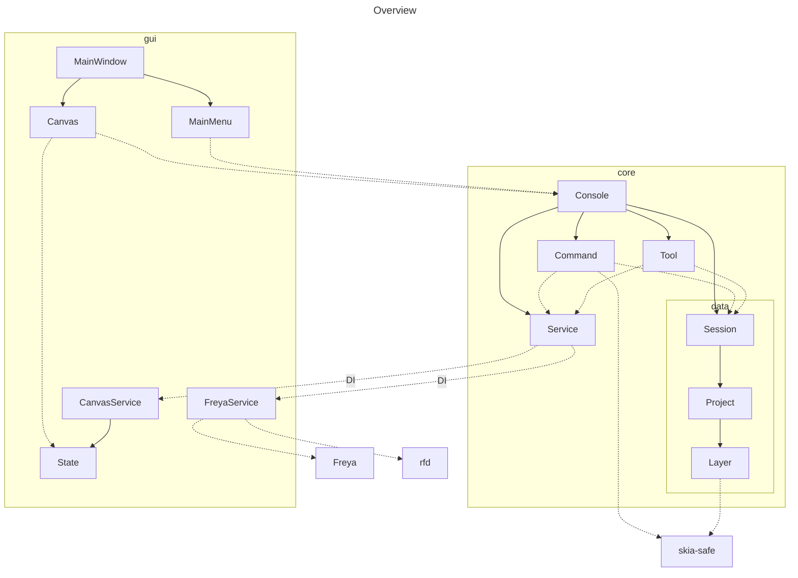

```mermaid
---
title: Overview
---

flowchart TB

subgraph core
    direction TB

    subgraph data
        direction TB
        Session --> Project
        Project --> Layer
    end

    Console --> Command & Service & Tool & Session
    Command & Tool -.-> Service & Session
end

subgraph gui
    direction TB
    MainWindow --> Canvas & MainMenu
    
    Canvas -.-> Console
    MainMenu -.-> Console
    
    Canvas -.-> State
    CanvasService --> State
    Service -.DI.-> CanvasService & FreyaService
end

FreyaService -.-> Freya
FreyaService -.-> rfd

Command -.-> skia-safe
Layer -.-> skia-safe
```
