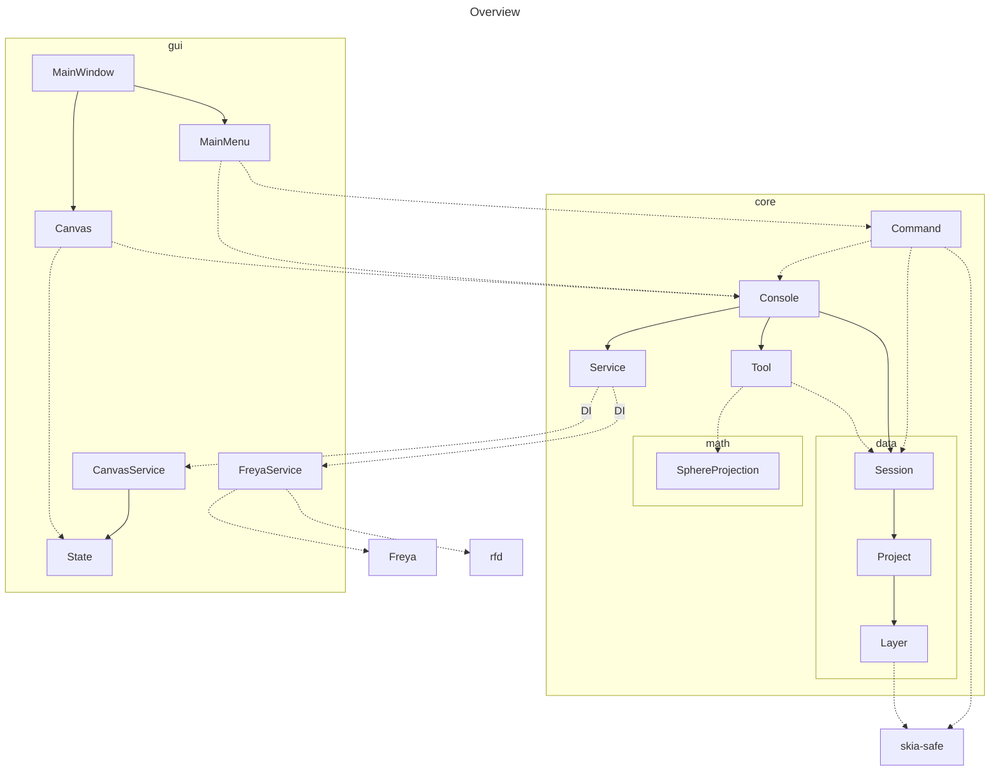

```mermaid
---
title: Overview
---

flowchart TB
    subgraph core
        direction TB

        subgraph data
            direction TB
            Session --> Project
            Project --> Layer
        end

        Tool -.-> SphereProjection
        Command -.-> Console
        Command & Tool -.-> Session
        Console --> Service & Tool & Session

        subgraph math
            SphereProjection
        end
    end

    subgraph gui
        direction TB
        MainWindow --> Canvas & MainMenu
        Canvas -.-> State
        Canvas -.-> Console
        MainMenu -.-> Console & Command
        CanvasService --> State
        Service -. DI .-> CanvasService & FreyaService
    end

    FreyaService -.-> Freya
    FreyaService -.-> rfd
    Command -.-> skia-safe
    Layer -.-> skia-safe
```
